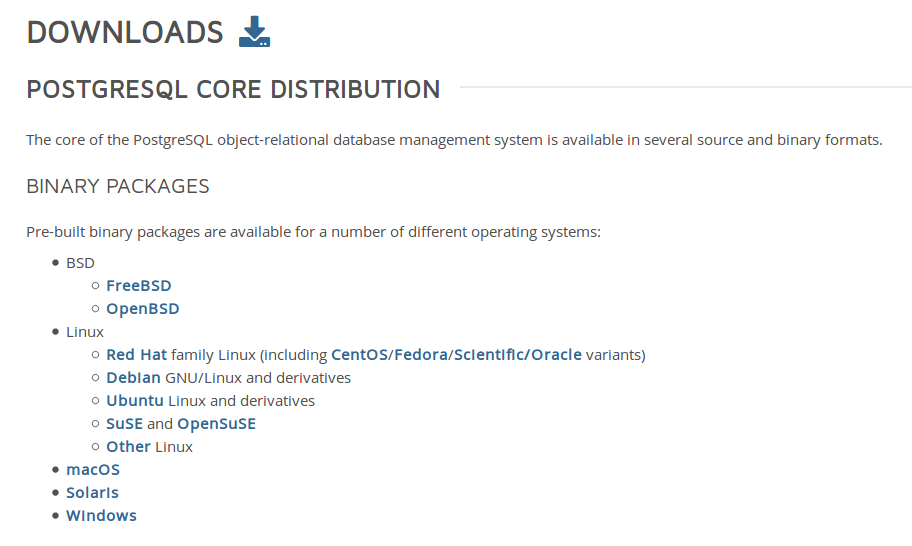
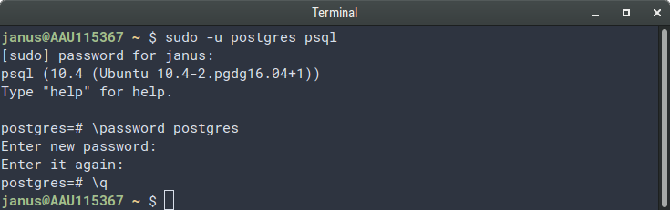
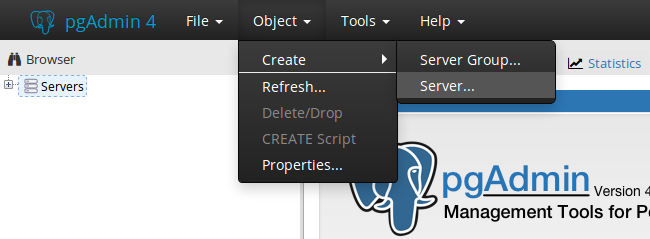
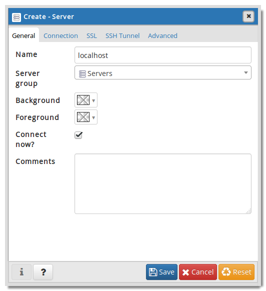
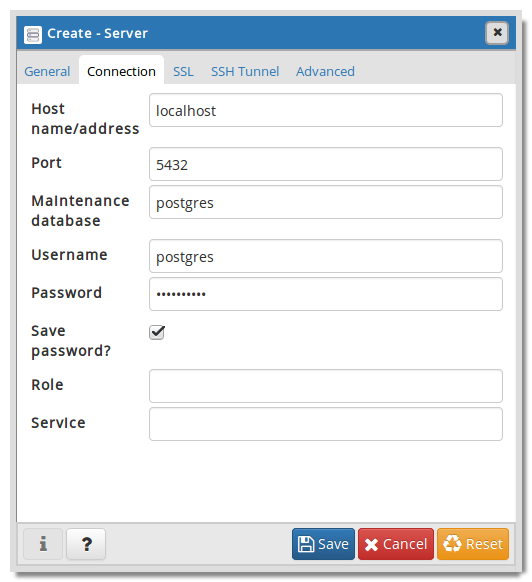
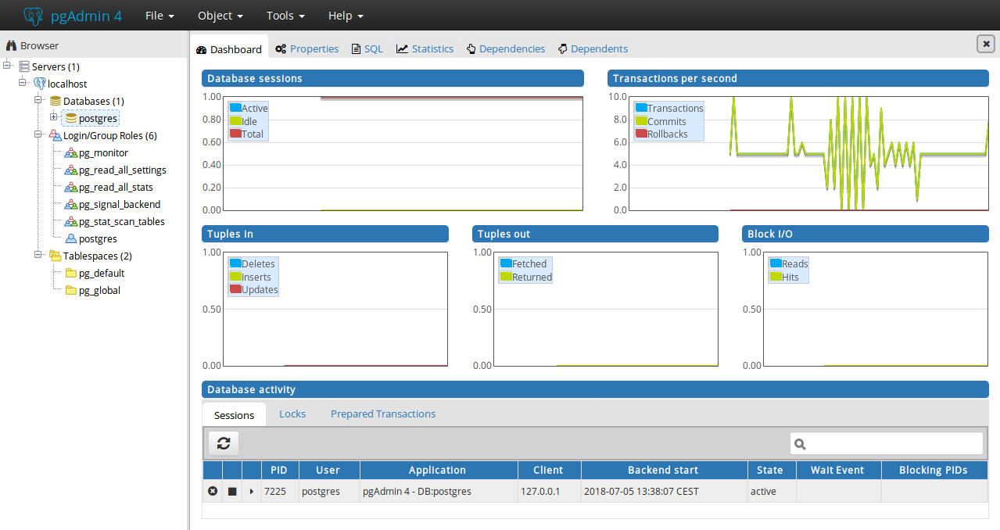

# PostgreSQL installation and setup guide

## Install PostgreSQL and pgAdmin 4

Go to <https://www.postgresql.org/download> and follow the link for your system.





### Windows / MacOS

For Windows and MacOS, there is an easy-to-use installer available ("Interactive installer by EnterpriseDB"), which includes all we need.
During installation it should take care of everything (like setting a password for the superuser).


### Ubuntu

For Ubuntu and other Linux-based systems, there's a few more steps involved.
Note that these instructions are specifically for Ubuntu, but should also work if you're using a derivative of Ubuntu, e.g. Linux Mint.

The PostgreSQL and pgAdmin available in Ubuntu's default repository are both old versions, so to get the most up-to-date versions, we need to add the PostgreSQL's own repository to the software source list.

Create a sourcelist file for the repository (requires superuser):

```bash
sudo touch /etc/apt/sources.list.d/pgdg.list
```

Add the following line to the newly created file:

```
deb http://apt.postgresql.org/pub/repos/apt/ xenial-pgdg main
```

**NB:** the `xenial` part of that line depends on your version of Ubuntu.
Swap `xenial` for the appropriate version codename:

Version | Codename
--- | ---
14.04 | `trusty`
16.04 | `xenial`
18.04 | `bionic`

Alternatively, you can check by running the following command:

```bash
lsb_release -c
```

Next, we need to import a signing key for the added repository and refresh `apt`'s content index:

```bash
wget --quiet -O - https://www.postgresql.org/media/keys/ACCC4CF8.asc | sudo apt-key add -
sudo apt-get update
```

Now we can install the programs:

```bash
sudo apt-get install postgresql pgadmin4
```


## Configure PostgreSQL server

In order to use pgAdmin 4, the default superuser `postgres` needs to have a password set.
This happens during installation on Windows and MacOS, but must be done manually on Ubuntu.

Run the PostgreSQL command line tool, `psql`, as the user `postgres` to get in:

```bash
sudo -u postgres psql
```

Set the password (it will prompt you to type one) and quit:

```
\password postgres
\q
```



Once `postgres` has a password, run pgAdmin.
This will open a tab in your default web browser, as pgAdmin is implemented as a Python web app.
If the server `localhost` is not already available, add it manually:



Make sure you set the field _hostname/address_ to `localhost` and supply the password for `postgres` from earlier:

 

If you get errors at this point, you might have to change some configurations to allow for certain kinds of connections to the PostgreSQL server that pgAdmin needs:

- Open the file `/etc/postgresql/10/main/pg_hba.conf` (requires superuser)
- Find the line describing local socket connections, it looks like this:
```
local   all             all                                      peer
```
- Change `peer` to `md5`
- Find the line describing local loopback connections over IPv6:
```
host    all             all             ::1/128                 ident
```
- Change `ident` to `md5`
- Save and close
- Restart the PostgreSQL server:
```bash
sudo service postgresql restart
```


## End result

If all goes well, you should have a screen that looks like this:


